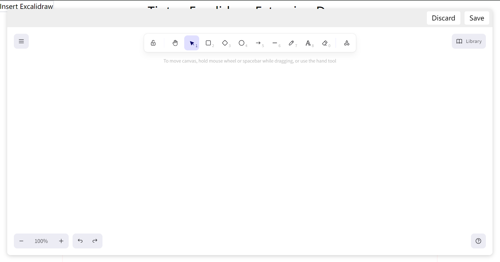

# tiptap-excalidraw-extension

excalidraw extension for tiptap

## Installation

```bash
# npm
npm install tiptap-excalidraw-extension

# yarn
yarn add tiptap-excalidraw-extension

# pnpm
pnpm install tiptap-excalidraw-extension
```

## Screenshots



## Development

```bash
yarn dev

# open a second terminal
cd examples/react-demo && yarn linkExtension
```

## RoadMap

- [x] Basic Element support
- [ ] Image support
- [ ] Support Vue intergration
- [ ] Collaboration support

## Great thanks

- [tiptap](https://github.com/ueberdosis/tiptap)
- [excalidraw](https://github.com/excalidraw/excalidraw)
